<div align="center">

<h1>STS2 WineFox Mod</h1>
<div style="display: flex;flex-direction: row;justify-content: center;">
 
 
 
 
<a href="https://github.com/BAKAOLC/STS2-RitsuLib"></a> 

</div>
  <div>
    <b>简体中文</b> | <a href="README_EN.md">English</a>
  </div>
</div>


WineFox（酒狐）是一个出自于Minecraft模组[车万女仆](https://modrinth.com/mod/touhou-little-maid)的角色，现在作为杀戮尖塔2的一个自定义角色Mod，围绕**材料合成**与**资源管理**的玩法设计。通过获取木板、圆石、铁锭、钻石等材料，利用合成、应力等机制打出强力组合。

---

## 角色概览

| 属性 | 值 |
|------|----|
| 初始 HP | 80 |
| 初始金币 | 99 |
| 主题色 | `#ffaf50`（橙色） |
| 初始遗物 | 手摇曲柄（HandCrank） |

### 初始牌组

| 卡牌 | 数量 |
|------|------|
| 打击（WineFoxStrike） | 4 |
| 防御（WineFoxDefend） | 4 |
| 基础采掘（BasicMine） | 1 |
| 基础合成（BasicCraft） | 1 |

---

## 安装指南

1. 在**Releases**下载编译好的酒狐mod，里面已经包含了对应版本的**RitsuLib**前置。如果需要下载其他版本的前置请到[RitsuLib仓库](https://github.com/BAKAOLC/STS2-RitsuLib)下载。
2. 打开游戏根目录(即Slay the Spire 2文件夹)，创建mods文件夹，注意mods都是小写，然后把下载好的压缩包解压到mods文件夹内。
3. 运行游戏，并开启mod。注意：第一次使用mod时，游戏会自动将无mod存档隔离。


## 卡牌列表

<style>
.card-mini td:first-child, .card-mini td:last-child {
  width: 1%;
  white-space: nowrap;
}
.card-mini td:nth-child(2) {
  width: 98%;
}
</style>

### Basic（初始牌组）

<table>
  <tr>
    <td valign="top" style="width: 220px;">
      <table class="card-mini" style="width: 100%; table-layout: auto;">
        <tr><td>1</td><td>基础合成<br/>Basic Crafting</td><td></td></tr>
        <tr><td></td><td></td><td></td></tr>
        <tr><td></td><td>Basic|技能</td><td></td></tr>
        <tr><td></td><td>**合成**。获得 5 点格挡。**保留**</td><td></td></tr>
      </table>
    </td>
    <td valign="top" style="width: 220px;">
      <table class="card-mini" style="width: 100%; table-layout: auto;">
        <tr><td>1</td><td>基础采掘<br/>Basic Mining</td><td></td></tr>
        <tr><td></td><td></td><td></td></tr>
        <tr><td></td><td>Basic|技能</td><td></td></tr>
        <tr><td></td><td>获得 2 木板 和 2 圆石。</td><td></td></tr>
      </table>
    </td>
    <td valign="top" style="width: 220px;">
      <table class="card-mini" style="width: 100%; table-layout: auto;">
        <tr><td>1</td><td>防御<br/>Defend</td><td></td></tr>
        <tr><td></td><td></td><td></td></tr>
        <tr><td></td><td>Basic|技能</td><td></td></tr>
        <tr><td></td><td>获得 5 点格挡。</td><td></td></tr>
      </table>
    </td>
  </tr>
  <tr>
    <td valign="top" style="width: 220px;">
      <table class="card-mini" style="width: 100%; table-layout: auto;">
        <tr><td>1</td><td>打击<br/>Strike</td><td></td></tr>
        <tr><td></td><td></td><td></td></tr>
        <tr><td></td><td>Basic|攻击</td><td></td></tr>
        <tr><td></td><td>造成 6 点伤害。</td><td></td></tr>
      </table>
    </td>
    <td></td>
    <td></td>
  </tr>
</table>


### Common（普通）

<table>
  <tr>
    <td valign="top" style="width: 220px;">
      <table class="card-mini" style="width: 100%; table-layout: auto;">
        <tr><td>1</td><td>"白色僵尸"<br/>"White Zombie"</td><td></td></tr>
        <tr><td></td><td></td><td></td></tr>
        <tr><td></td><td>Common|攻击</td><td></td></tr>
        <tr><td></td><td>造成 8 点伤害，获得 1 个铁锭。</td><td></td></tr>
      </table>
    </td>
    <td valign="top" style="width: 220px;">
      <table class="card-mini" style="width: 100%; table-layout: auto;">
        <tr><td>0</td><td>备用工作台<br/>Backup Workbench</td><td></td></tr>
        <tr><td></td><td></td><td></td></tr>
        <tr><td></td><td>Common|技能</td><td></td></tr>
        <tr><td></td><td>**消耗**；**合成**。</td><td></td></tr>
      </table>
    </td>
    <td valign="top" style="width: 220px;">
      <table class="card-mini" style="width: 100%; table-layout: auto;">
        <tr><td>1</td><td>屏障波<br/>Barrier Wave</td><td></td></tr>
        <tr><td></td><td>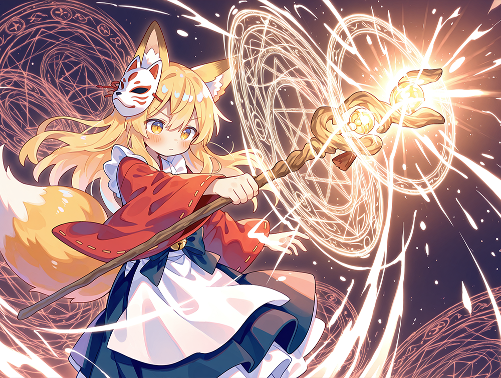</td><td></td></tr>
        <tr><td></td><td>Common|技能</td><td></td></tr>
        <tr><td></td><td>对所有敌人造成 6 点不可格挡伤害，获得 5 点格挡。</td><td></td></tr>
      </table>
    </td>
  </tr>
  <tr>
    <td valign="top" style="width: 220px;">
      <table class="card-mini" style="width: 100%; table-layout: auto;">
        <tr><td>0</td><td>更换装备<br/>Change Equipment</td><td></td></tr>
        <tr><td></td><td>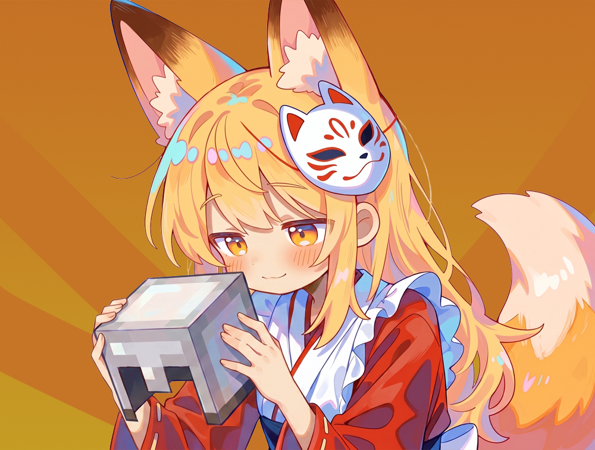</td><td></td></tr>
        <tr><td></td><td>Common|技能</td><td></td></tr>
        <tr><td></td><td>抽 2 张牌，选择手牌中 2 张牌洗回抽牌堆。</td><td></td></tr>
      </table>
    </td>
    <td valign="top" style="width: 220px;">
      <table class="card-mini" style="width: 100%; table-layout: auto;">
        <tr><td>1</td><td>全力冲撞<br/>Full-Force Ram</td><td></td></tr>
        <tr><td></td><td></td><td></td></tr>
        <tr><td></td><td>Common|攻击</td><td></td></tr>
        <tr><td></td><td>对所有敌人造成 12 点伤害，将一张晕眩洗入抽牌堆。</td><td></td></tr>
      </table>
    </td>
    <td valign="top" style="width: 220px;">
      <table class="card-mini" style="width: 100%; table-layout: auto;">
        <tr><td>1</td><td>获得木头<br/>Getting Wood</td><td></td></tr>
        <tr><td></td><td></td><td></td></tr>
        <tr><td></td><td>Common|攻击</td><td></td></tr>
        <tr><td></td><td>获得 4 个木板。对敌人造成等同于本次获得木板数的伤害。</td><td></td></tr>
      </table>
    </td>
  </tr>
  <tr>
    <td valign="top" style="width: 220px;">
      <table class="card-mini" style="width: 100%; table-layout: auto;">
        <tr><td>1</td><td>囤积习惯<br/>Hoarding Habit</td><td></td></tr>
        <tr><td></td><td></td><td></td></tr>
        <tr><td></td><td>Common|技能</td><td></td></tr>
        <tr><td></td><td>获得 1 个木板和 1 个圆石。在下个回合开始时获得 2 个木板和 2 个圆石。</td><td></td></tr>
      </table>
    </td>
    <td valign="top" style="width: 220px;">
      <table class="card-mini" style="width: 100%; table-layout: auto;">
        <tr><td>1</td><td>临时武器<br/>Improvised Weapon</td><td></td></tr>
        <tr><td></td><td></td><td></td></tr>
        <tr><td></td><td>Common|攻击</td><td></td></tr>
        <tr><td></td><td>造成 8 点伤害，消耗一张牌。</td><td></td></tr>
      </table>
    </td>
    <td valign="top" style="width: 220px;">
      <table class="card-mini" style="width: 100%; table-layout: auto;">
        <tr><td>0</td><td>轻装突击<br/>Light Assault</td><td></td></tr>
        <tr><td></td><td>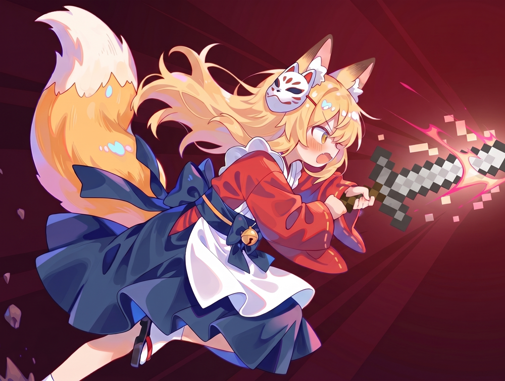</td><td></td></tr>
        <tr><td></td><td>Common|攻击</td><td></td></tr>
        <tr><td></td><td>造成伤害。你每有 2 份材料，这张牌的伤害就降低 1 点。</td><td></td></tr>
      </table>
    </td>
  </tr>
  <tr>
    <td valign="top" style="width: 220px;">
      <table class="card-mini" style="width: 100%; table-layout: auto;">
        <tr><td>1</td><td>魔法飞弹<br/>Magic Missile</td><td></td></tr>
        <tr><td></td><td></td><td></td></tr>
        <tr><td></td><td>Common|技能</td><td></td></tr>
        <tr><td></td><td>使一名敌人失去 6 点生命，共 2 次。</td><td></td></tr>
      </table>
    </td>
    <td valign="top" style="width: 220px;">
      <table class="card-mini" style="width: 100%; table-layout: auto;">
        <tr><td>1</td><td>种植树木<br/>Plant Trees</td><td></td></tr>
        <tr><td></td><td></td><td></td></tr>
        <tr><td></td><td>Common|技能</td><td></td></tr>
        <tr><td></td><td>获得 5 点格挡。在下回合开始时获得 4 个木板。</td><td></td></tr>
      </table>
    </td>
    <td valign="top" style="width: 220px;">
      <table class="card-mini" style="width: 100%; table-layout: auto;">
        <tr><td>0</td><td>预处理<br/>Preprocessing</td><td></td></tr>
        <tr><td></td><td></td><td></td></tr>
        <tr><td></td><td>Common|技能</td><td></td></tr>
        <tr><td></td><td>**固有**；**消耗**；获得 3 个木板与 3 个圆石。</td><td></td></tr>
      </table>
    </td>
  </tr>
  <tr>
    <td valign="top" style="width: 220px;">
      <table class="card-mini" style="width: 100%; table-layout: auto;">
        <tr><td>1</td><td>快速攻击<br/>Quick Attack</td><td></td></tr>
        <tr><td></td><td></td><td></td></tr>
        <tr><td></td><td>Common|攻击</td><td></td></tr>
        <tr><td></td><td>**虚无**；造成伤害数次。</td><td></td></tr>
      </table>
    </td>
    <td valign="top" style="width: 220px;">
      <table class="card-mini" style="width: 100%; table-layout: auto;">
        <tr><td>1</td><td>速成掩体<br/>Quick Shelter</td><td></td></tr>
        <tr><td></td><td></td><td></td></tr>
        <tr><td></td><td>Common|技能</td><td></td></tr>
        <tr><td></td><td>**虚无**；获得木板和圆石。获得格挡。抽 1 张牌。</td><td></td></tr>
      </table>
    </td>
    <td valign="top" style="width: 220px;">
      <table class="card-mini" style="width: 100%; table-layout: auto;">
        <tr><td>1</td><td>重整旗鼓<br/>Regroup</td><td></td></tr>
        <tr><td></td><td></td><td></td></tr>
        <tr><td></td><td>Common|技能</td><td></td></tr>
        <tr><td></td><td>**消耗**；抽 1 张牌。将弃牌堆中的 1 张牌放入你的手牌。</td><td></td></tr>
      </table>
    </td>
  </tr>
  <tr>
    <td valign="top" style="width: 220px;">
      <table class="card-mini" style="width: 100%; table-layout: auto;">
        <tr><td>1</td><td>换挡，加速，起飞<br/>Shift, Accelerate, Take Off</td><td></td></tr>
        <tr><td></td><td></td><td></td></tr>
        <tr><td></td><td>Common|技能</td><td></td></tr>
        <tr><td></td><td>获得 1 层应力。抽 1 张牌。</td><td></td></tr>
      </table>
    </td>
    <td valign="top" style="width: 220px;">
      <table class="card-mini" style="width: 100%; table-layout: auto;">
        <tr><td>1</td><td>井字格<br/>Tic-Tac-Toe Grid</td><td></td></tr>
        <tr><td></td><td></td><td></td></tr>
        <tr><td></td><td>Common|攻击</td><td></td></tr>
        <tr><td></td><td>造成 8 点伤害。**合成**。</td><td></td></tr>
      </table>
    </td>
    <td valign="top" style="width: 220px;">
      <table class="card-mini" style="width: 100%; table-layout: auto;">
        <tr><td>0</td><td>传统派<br/>Traditionalist</td><td></td></tr>
        <tr><td></td><td></td><td></td></tr>
        <tr><td></td><td>Common|技能</td><td></td></tr>
        <tr><td></td><td>花费 2 木板。**合成**。抽 1 张牌。</td><td></td></tr>
      </table>
    </td>
  </tr>
  <tr>
    <td valign="top" style="width: 220px;">
      <table class="card-mini" style="width: 100%; table-layout: auto;">
        <tr><td>3</td><td>空置域<br/>Vacant Domain</td><td></td></tr>
        <tr><td></td><td></td><td></td></tr>
        <tr><td></td><td>Common|技能</td><td></td></tr>
        <tr><td></td><td>获得 14 点格挡。获得 8 圆石。</td><td></td></tr>
      </table>
    </td>
    <td valign="top" style="width: 220px;">
      <table class="card-mini" style="width: 100%; table-layout: auto;">
        <tr><td>1</td><td>摇曲柄<br/>Wind Crank</td><td></td></tr>
        <tr><td></td><td></td><td></td></tr>
        <tr><td></td><td>Common|技能</td><td></td></tr>
        <tr><td></td><td>获得 3 层应力，结束回合。</td><td></td></tr>
      </table>
    </td>
    <td></td>
  </tr>
</table>

### Uncommon（罕见）

<table>
  <tr>
    <td valign="top" style="width: 220px;">
      <table class="card-mini" style="width: 100%; table-layout: auto;">
        <tr><td>0</td><td>交流发电机<br/>Alternator</td><td></td></tr>
        <tr><td></td><td></td><td></td></tr>
        <tr><td></td><td>Uncommon|技能</td><td></td></tr>
        <tr><td></td><td>获得能量。消耗 1 层应力，额外获得能量。</td><td></td></tr>
      </table>
    </td>
    <td valign="top" style="width: 220px;">
      <table class="card-mini" style="width: 100%; table-layout: auto;">
        <tr><td>0</td><td>另辟蹊径<br/>Another Way</td><td></td></tr>
        <tr><td></td><td></td><td></td></tr>
        <tr><td></td><td>Uncommon|技能</td><td></td></tr>
        <tr><td></td><td>花费 2 木板，获得 5 点格挡，抽 2 张牌。</td><td></td></tr>
      </table>
    </td>
    <td valign="top" style="width: 220px;">
      <table class="card-mini" style="width: 100%; table-layout: auto;">
        <tr><td>1</td><td>预判先机<br/>Anticipate Advantage</td><td></td></tr>
        <tr><td></td><td></td><td></td></tr>
        <tr><td></td><td>Uncommon|技能</td><td></td></tr>
        <tr><td></td><td>如果一名敌人的意图为攻击，你就获得 3 点敏捷。</td><td></td></tr>
      </table>
    </td>
  </tr>
  <tr>
    <td valign="top" style="width: 220px;">
      <table class="card-mini" style="width: 100%; table-layout: auto;">
        <tr><td>1</td><td>蓝图打印<br/>Blueprint Printing</td><td></td></tr>
        <tr><td></td><td></td><td></td></tr>
        <tr><td></td><td>Uncommon|技能</td><td></td></tr>
        <tr><td></td><td>**消耗**；花费木板和原石，选择手牌 1 张卡，将其数张费用-1、带有消耗的复制品加入手牌。</td><td></td></tr>
      </table>
    </td>
    <td valign="top" style="width: 220px;">
      <table class="card-mini" style="width: 100%; table-layout: auto;">
        <tr><td>1</td><td>水桶<br/>Bucket</td><td></td></tr>
        <tr><td></td><td></td><td></td></tr>
        <tr><td></td><td>Uncommon|技能</td><td></td></tr>
        <tr><td></td><td>**消耗**；获得 8 点格挡。下回合开始时再获得 8 点格挡。对所有单位施加 2 层虚弱。</td><td></td></tr>
      </table>
    </td>
    <td valign="top" style="width: 220px;">
      <table class="card-mini" style="width: 100%; table-layout: auto;">
        <tr><td>3</td><td>粉碎轮组<br/>Crushing Wheel Array</td><td></td></tr>
        <tr><td></td><td></td><td></td></tr>
        <tr><td></td><td>Uncommon|攻击</td><td></td></tr>
        <tr><td></td><td>对所有敌人造成伤害。每在本回合花费过一次材料，这张牌的费用就 -1。</td><td></td></tr>
      </table>
    </td>
  </tr>
  <tr>
    <td valign="top" style="width: 220px;">
      <table class="card-mini" style="width: 100%; table-layout: auto;">
        <tr><td>2</td><td>石锥陷阱<br/>Dripstone Trap</td><td></td></tr>
        <tr><td></td><td></td><td></td></tr>
        <tr><td></td><td>Uncommon|攻击</td><td></td></tr>
        <tr><td></td><td>消耗所有圆石，每消耗一个就对随机敌人造成伤害，施加 1 层易伤。</td><td></td></tr>
      </table>
    </td>
    <td valign="top" style="width: 220px;">
      <table class="card-mini" style="width: 100%; table-layout: auto;">
        <tr><td>1</td><td>紧急修复<br/>Emergency Repair</td><td></td></tr>
        <tr><td></td><td></td><td></td></tr>
        <tr><td></td><td>Uncommon|攻击</td><td></td></tr>
        <tr><td></td><td>造成伤害，获得格挡，在下个回合开始时获得 2 应力。</td><td></td></tr>
      </table>
    </td>
    <td valign="top" style="width: 220px;">
      <table class="card-mini" style="width: 100%; table-layout: auto;">
        <tr><td>1</td><td>溃蚀<br/>Erosion</td><td></td></tr>
        <tr><td></td><td></td><td></td></tr>
        <tr><td></td><td>Uncommon|技能</td><td></td></tr>
        <tr><td></td><td>给予一名敌人 6 层消亡。所有拥有消亡的敌人失去等同于其层数的生命。</td><td></td></tr>
      </table>
    </td>
  </tr>
  <tr>
    <td valign="top" style="width: 220px;">
      <table class="card-mini" style="width: 100%; table-layout: auto;">
        <tr><td>2</td><td>狐咬<br/>Fox Bite</td><td></td></tr>
        <tr><td></td><td></td><td></td></tr>
        <tr><td></td><td>Uncommon|技能</td><td></td></tr>
        <tr><td></td><td>**保留**；给予 4 层虚弱。给予 4 层易伤。</td><td></td></tr>
      </table>
    </td>
    <td valign="top" style="width: 220px;">
      <table class="card-mini" style="width: 100%; table-layout: auto;">
        <tr><td>2</td><td>全力倾泻<br/>Full Barrage</td><td></td></tr>
        <tr><td></td><td></td><td></td></tr>
        <tr><td></td><td>Uncommon|攻击</td><td></td></tr>
        <tr><td></td><td>花费所有材料。每花费 1 个材料，对目标造成伤害。</td><td></td></tr>
      </table>
    </td>
    <td valign="top" style="width: 220px;">
      <table class="card-mini" style="width: 100%; table-layout: auto;">
        <tr><td>4</td><td>重锤下砸<br/>Hammer Slam</td><td></td></tr>
        <tr><td></td><td>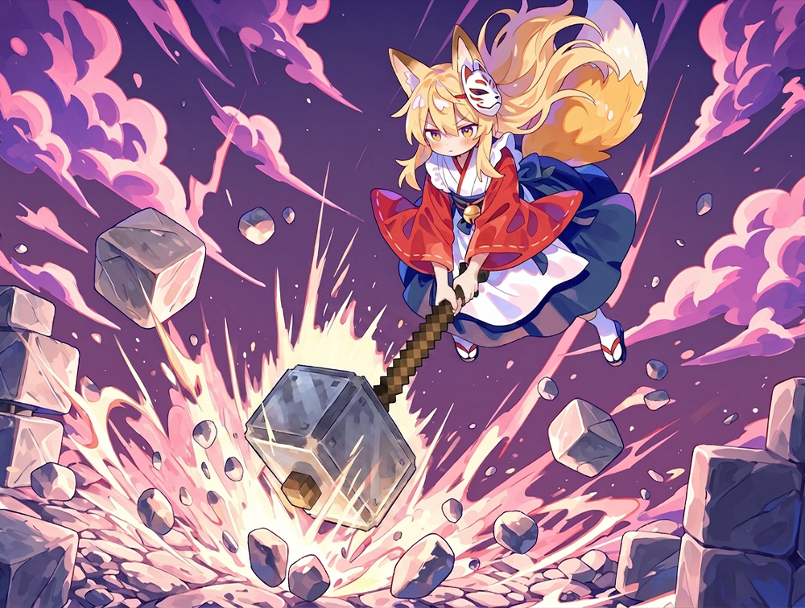</td><td></td></tr>
        <tr><td></td><td>Uncommon|攻击</td><td></td></tr>
        <tr><td></td><td>**保留**；每次被保留时费用 -1。造成伤害，力量效果的伤害加成变为 3 倍。</td><td></td></tr>
      </table>
    </td>
  </tr>
  <tr>
    <td valign="top" style="width: 220px;">
      <table class="card-mini" style="width: 100%; table-layout: auto;">
        <tr><td>1</td><td>高度专注<br/>Highly Focused</td><td></td></tr>
        <tr><td></td><td></td><td></td></tr>
        <tr><td></td><td>Uncommon|技能</td><td></td></tr>
        <tr><td></td><td>在本回合翻倍你已有的力量。</td><td></td></tr>
      </table>
    </td>
    <td valign="top" style="width: 220px;">
      <table class="card-mini" style="width: 100%; table-layout: auto;">
        <tr><td>1</td><td>间隙咏唱<br/>Intermittent Chanting</td><td></td></tr>
        <tr><td></td><td>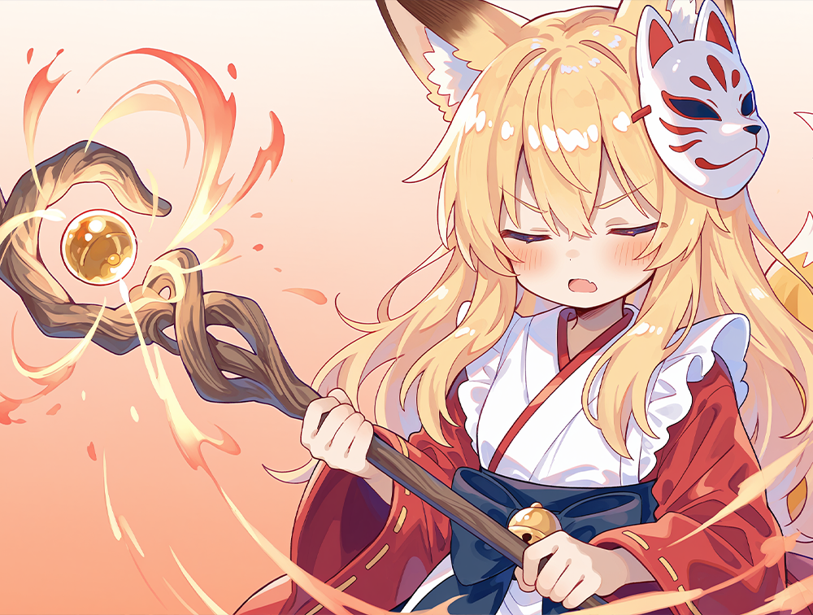</td><td></td></tr>
        <tr><td></td><td>Uncommon|能力</td><td></td></tr>
        <tr><td></td><td>获得 1 层虚弱。每当你使敌人失去生命时，该敌人获得 1 点格挡，你获得 2 点格挡。</td><td></td></tr>
      </table>
    </td>
    <td valign="top" style="width: 220px;">
      <table class="card-mini" style="width: 100%; table-layout: auto;">
        <tr><td>1</td><td>森罗物语：炒锅<br/>Kaleidoscope Tales: Wok</td><td></td></tr>
        <tr><td></td><td></td><td></td></tr>
        <tr><td></td><td>Uncommon|技能</td><td></td></tr>
        <tr><td></td><td>抽 1 张牌。选择 1 张手牌变化。</td><td></td></tr>
      </table>
    </td>
  </tr>
  <tr>
    <td valign="top" style="width: 220px;">
      <table class="card-mini" style="width: 100%; table-layout: auto;">
        <tr><td>1</td><td>弹射置物台<br/>Launch Platform</td><td></td></tr>
        <tr><td></td><td></td><td></td></tr>
        <tr><td></td><td>Uncommon|能力</td><td></td></tr>
        <tr><td></td><td>每回合第一次消耗应力时，获得 1 费。</td><td></td></tr>
      </table>
    </td>
    <td valign="top" style="width: 220px;">
      <table class="card-mini" style="width: 100%; table-layout: auto;">
        <tr><td>1</td><td>物流<br/>Logistics</td><td></td></tr>
        <tr><td></td><td></td><td></td></tr>
        <tr><td></td><td>Uncommon|技能</td><td></td></tr>
        <tr><td></td><td>选择你手牌中的最多 1 张牌，将其消耗并将其一份复制品加入一名队友的手牌。升级后可选择任意数量。</td><td></td></tr>
      </table>
    </td>
    <td valign="top" style="width: 220px;">
      <table class="card-mini" style="width: 100%; table-layout: auto;">
        <tr><td>1</td><td>蓄魔涌动<br/>Mana Surge</td><td></td></tr>
        <tr><td></td><td></td><td></td></tr>
        <tr><td></td><td>Uncommon|技能</td><td></td></tr>
        <tr><td></td><td>获得咏唱（基础 2，最多 4；升级后上限 6）。<br/>抽 2 张牌。</td><td></td></tr>
      </table>
    </td>
  </tr>
  <tr>
    <td valign="top" style="width: 220px;">
      <table class="card-mini" style="width: 100%; table-layout: auto;">
        <tr><td>2</td><td>量产<br/>Mass Production</td><td></td></tr>
        <tr><td></td><td></td><td></td></tr>
        <tr><td></td><td>Uncommon|技能</td><td></td></tr>
        <tr><td></td><td>**仅多人**；当你在本回合合成时，将 1 张合成物的复制品分给你的每个队友。</td><td></td></tr>
      </table>
    </td>
    <td valign="top" style="width: 220px;">
      <table class="card-mini" style="width: 100%; table-layout: auto;">
        <tr><td>2</td><td>动力钻头<br/>Mechanical Drill</td><td></td></tr>
        <tr><td></td><td></td><td></td></tr>
        <tr><td></td><td>Uncommon|攻击</td><td></td></tr>
        <tr><td></td><td>造成伤害，共数次。获得 2 个铁锭。如果花费了应力，返还能量。</td><td></td></tr>
      </table>
    </td>
    <td valign="top" style="width: 220px;">
      <table class="card-mini" style="width: 100%; table-layout: auto;">
        <tr><td>1</td><td>动力锯<br/>Mechanical Saw</td><td></td></tr>
        <tr><td></td><td></td><td></td></tr>
        <tr><td></td><td>Uncommon|攻击</td><td></td></tr>
        <tr><td></td><td>对所有敌人造成伤害。消耗 1 应力，额外造成更多伤害。</td><td></td></tr>
      </table>
    </td>
  </tr>
  <tr>
    <td valign="top" style="width: 220px;">
      <table class="card-mini" style="width: 100%; table-layout: auto;">
        <tr><td>1</td><td>回忆<br/>Memory</td><td></td></tr>
        <tr><td></td><td></td><td></td></tr>
        <tr><td></td><td>Uncommon|能力</td><td></td></tr>
        <tr><td></td><td>在你的回合开始时，将你上一回合最后打出的技能牌的一张带有消耗的复制品加入你的手牌。</td><td></td></tr>
      </table>
    </td>
    <td valign="top" style="width: 220px;">
      <table class="card-mini" style="width: 100%; table-layout: auto;">
        <tr><td>1</td><td>心胜于物<br/>Mind Over Matter</td><td></td></tr>
        <tr><td></td><td>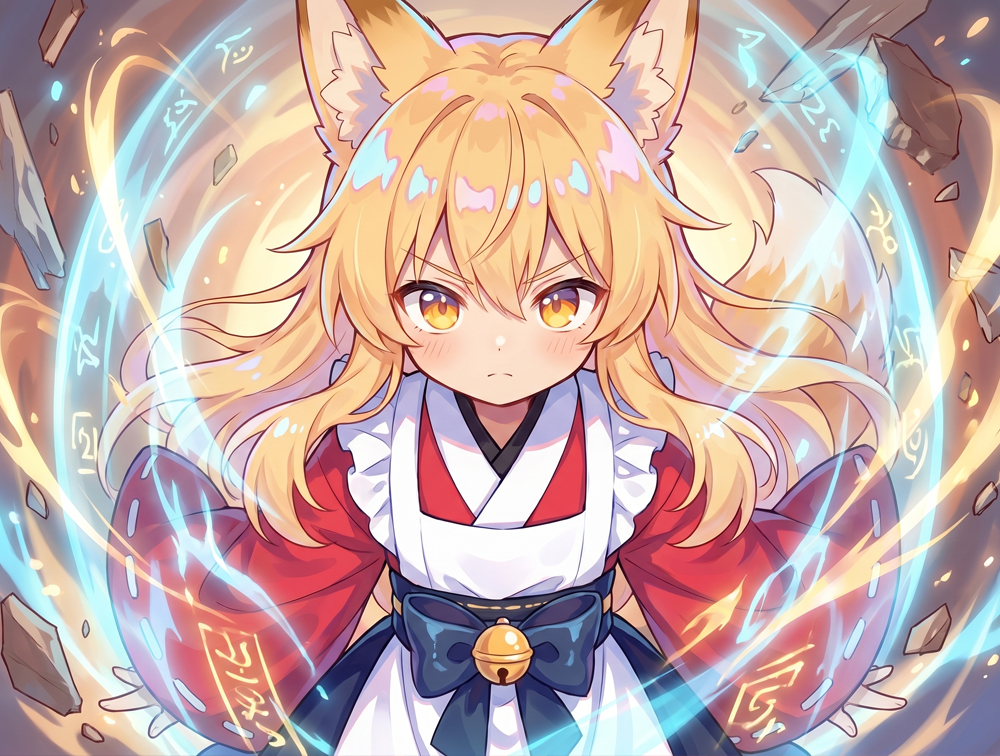</td><td></td></tr>
        <tr><td></td><td>Uncommon|能力</td><td></td></tr>
        <tr><td></td><td>你每次打出魔法牌时，获得1层咏唱。</td><td></td></tr>
      </table>
    </td>
    <td valign="top" style="width: 220px;">
      <table class="card-mini" style="width: 100%; table-layout: auto;">
        <tr><td>1</td><td>异界跨越<br/>Otherworld Crossing</td><td></td></tr>
        <tr><td></td><td></td><td></td></tr>
        <tr><td></td><td>Uncommon|能力</td><td></td></tr>
        <tr><td></td><td>每回合开始时，选择一张手牌，将其一张虚无、消耗的复制品加入到你的手牌。</td><td></td></tr>
      </table>
    </td>
  </tr>
  <tr>
    <td valign="top" style="width: 220px;">
      <table class="card-mini" style="width: 100%; table-layout: auto;">
        <tr><td>1</td><td>石化术<br/>Petrification</td><td></td></tr>
        <tr><td></td><td></td><td></td></tr>
        <tr><td></td><td>Uncommon|技能</td><td></td></tr>
        <tr><td></td><td>获得 4 个圆石。使所有敌人失去等同于获得圆石数量的生命。</td><td></td></tr>
      </table>
    </td>
    <td valign="top" style="width: 220px;">
      <table class="card-mini" style="width: 100%; table-layout: auto;">
        <tr><td>1</td><td>PressWToThink<br/>PressWToThink</td><td></td></tr>
        <tr><td></td><td></td><td></td></tr>
        <tr><td></td><td>Uncommon|技能</td><td></td></tr>
        <tr><td></td><td>**消耗**；从抽牌堆顶的 3 张牌中选择一张加入你的手牌，使其获得重放和消耗。</td><td></td></tr>
      </table>
    </td>
    <td valign="top" style="width: 220px;">
      <table class="card-mini" style="width: 100%; table-layout: auto;">
        <tr><td>1</td><td>生产记录<br/>Production Log</td><td></td></tr>
        <tr><td></td><td></td><td></td></tr>
        <tr><td></td><td>Uncommon|能力</td><td></td></tr>
        <tr><td></td><td>你在战斗中临时加入的牌获得保留。回合结束时每保留 1 张牌，你就獲得格擋。</td><td></td></tr>
      </table>
    </td>
  </tr>
  <tr>
    <td valign="top" style="width: 220px;">
      <table class="card-mini" style="width: 100%; table-layout: auto;">
        <tr><td>1</td><td>休养生息<br/>Recuperate</td><td></td></tr>
        <tr><td></td><td></td><td></td></tr>
        <tr><td></td><td>Uncommon|技能</td><td></td></tr>
        <tr><td></td><td>**消耗**；抽 5 张牌。丢弃手中所有攻击牌。</td><td></td></tr>
      </table>
    </td>
    <td valign="top" style="width: 220px;">
      <table class="card-mini" style="width: 100%; table-layout: auto;">
        <tr><td>1</td><td>救赎打击<br/>Redemption Strike</td><td></td></tr>
        <tr><td></td><td></td><td></td></tr>
        <tr><td></td><td>Uncommon|攻击</td><td></td></tr>
        <tr><td></td><td>造成伤害。治疗所有玩家生命值。</td><td></td></tr>
      </table>
    </td>
    <td valign="top" style="width: 220px;">
      <table class="card-mini" style="width: 100%; table-layout: auto;">
        <tr><td>2</td><td>河电站<br/>River Power Plant</td><td></td></tr>
        <tr><td></td><td></td><td></td></tr>
        <tr><td></td><td>Uncommon|技能</td><td></td></tr>
        <tr><td></td><td>获得格挡，获得 2 应力。</td><td></td></tr>
      </table>
    </td>
  </tr>
  <tr>
    <td valign="top" style="width: 220px;">
      <table class="card-mini" style="width: 100%; table-layout: auto;">
        <tr><td>X</td><td>抓挠<br/>Scratch</td><td></td></tr>
        <tr><td></td><td></td><td></td></tr>
        <tr><td></td><td>Uncommon|攻击</td><td></td></tr>
        <tr><td></td><td>造成 X 点伤害，共 2X 次。</td><td></td></tr>
      </table>
    </td>
    <td valign="top" style="width: 220px;">
      <table class="card-mini" style="width: 100%; table-layout: auto;">
        <tr><td>1</td><td>拔刀剑:无铭刀「木偶」<br/>Slash Blade: "Wooden Puppet"</td><td></td></tr>
        <tr><td></td><td></td><td></td></tr>
        <tr><td></td><td>Uncommon|能力</td><td></td></tr>
        <tr><td></td><td>每当你打出一张技能牌，获得 2 层活力。</td><td></td></tr>
      </table>
    </td>
    <td valign="top" style="width: 220px;">
      <table class="card-mini" style="width: 100%; table-layout: auto;">
        <tr><td>1</td><td>雪球糊脸<br/>Snowball to the Face</td><td></td></tr>
        <tr><td></td><td></td><td></td></tr>
        <tr><td></td><td>Uncommon|攻击</td><td></td></tr>
        <tr><td></td><td>造成伤害。本回合打出的下一张技能牌费用变为 0。</td><td></td></tr>
      </table>
    </td>
  </tr>
  <tr>
    <td valign="top" style="width: 220px;">
      <table class="card-mini" style="width: 100%; table-layout: auto;">
        <tr><td>0</td><td>应激<br/>Stress Response</td><td></td></tr>
        <tr><td></td><td>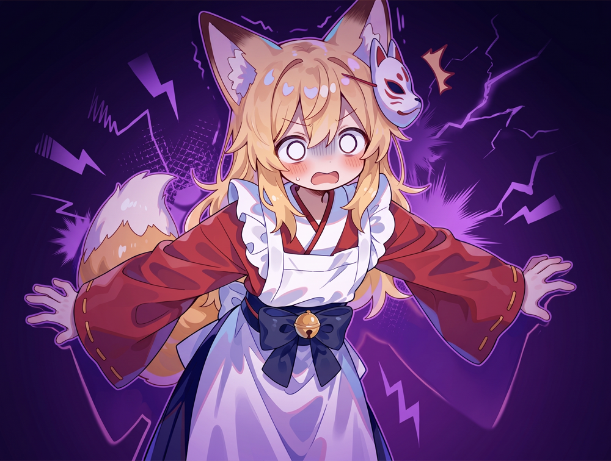</td><td></td></tr>
        <tr><td></td><td>Uncommon|技能</td><td></td></tr>
        <tr><td></td><td>**消耗**；失去 6 点生命值，获得 1 点最大生命值，获得能量并抽 2 张牌。</td><td></td></tr>
      </table>
    </td>
    <td valign="top" style="width: 220px;">
      <table class="card-mini" style="width: 100%; table-layout: auto;">
        <tr><td>1</td><td>横扫<br/>Sweep</td><td></td></tr>
        <tr><td></td><td>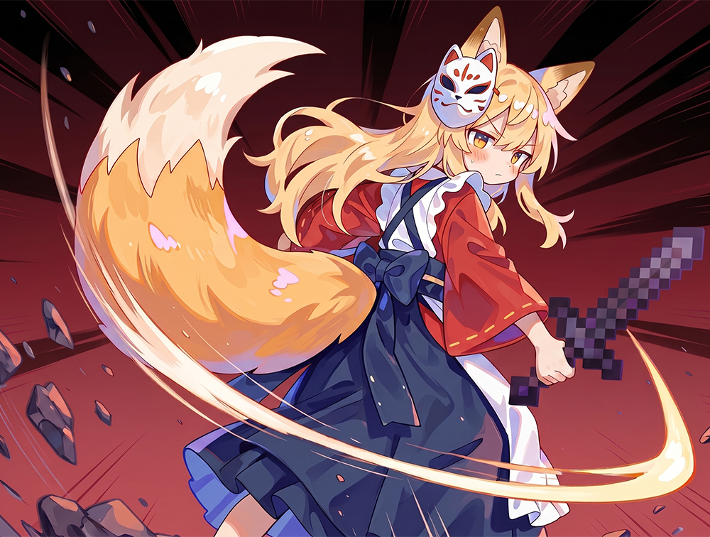</td><td></td></tr>
        <tr><td></td><td>Uncommon|攻击</td><td></td></tr>
        <tr><td></td><td>对所有敌人造成 7 点伤害。如果你没有格挡，再造成一次 7 点伤害。</td><td></td></tr>
      </table>
    </td>
    <td valign="top" style="width: 220px;">
      <table class="card-mini" style="width: 100%; table-layout: auto;">
        <tr><td>0</td><td>甜蜜的梦<br/>Sweet Dream</td><td></td></tr>
        <tr><td></td><td></td><td></td></tr>
        <tr><td></td><td>Uncommon|技能</td><td></td></tr>
        <tr><td></td><td>**消耗**；将所有手牌洗入抽牌堆，抽取等量的牌。</td><td></td></tr>
      </table>
    </td>
  </tr>
  <tr>
    <td valign="top" style="width: 220px;">
      <table class="card-mini" style="width: 100%; table-layout: auto;">
        <tr><td>1</td><td>三相祝福<br/>Triune Blessing</td><td></td></tr>
        <tr><td></td><td></td><td></td></tr>
        <tr><td></td><td>Uncommon|能力</td><td></td></tr>
        <tr><td></td><td>所有玩家获得 1 点力量、1 点敏捷和 1 点集中。<br/>最多消耗 2 点咏唱（升级后 4 点）。<br/>每消耗 1 点，额外获得 1 点力量和 1 点敏捷；每消耗 2 点，额外获得 1 点集中。</td><td></td></tr>
      </table>
    </td>
    <td valign="top" style="width: 220px;">
      <table class="card-mini" style="width: 100%; table-layout: auto;">
        <tr><td>2</td><td>工作台背包<br/>Workbench Backpack</td><td></td></tr>
        <tr><td></td><td></td><td></td></tr>
        <tr><td></td><td>Uncommon|技能</td><td></td></tr>
        <tr><td></td><td>获得 1 费。合成。将这张牌的费用减少 1。</td><td></td></tr>
      </table>
    </td>
    <td></td>
  </tr>
</table>

### Rare（稀有）

<table>
  <tr>
    <td valign="top" style="width: 220px;">
      <table style="width: 100%;">
        <tr><td>1</td><td>996<br/>996</td><td></td></tr>
        <tr><td></td><td></td><td></td></tr>
        <tr><td></td><td>Rare|技能</td><td></td></tr>
        <tr><td></td><td>选择你手牌中的最多 3 张牌变化为加班加点。</td><td></td></tr>
      </table>
    </td>
    <td valign="top" style="width: 220px;">
      <table class="card-mini" style="width: 100%; table-layout: auto;">
        <tr><td>0</td><td>全物品仓库<br/>All-Item Warehouse</td><td></td></tr>
        <tr><td></td><td></td><td></td></tr>
        <tr><td></td><td>Rare|技能</td><td></td></tr>
        <tr><td></td><td>**消耗**；获得 1 费；抽 1 张牌；获得 1 木板、1 圆石、1 铁锭、1 钻石。</td><td></td></tr>
      </table>
    </td>
    <td valign="top" style="width: 220px;">
      <table class="card-mini" style="width: 100%; table-layout: auto;">
        <tr><td>2</td><td>全副武装<br/>Arm To Teeth</td><td></td></tr>
        <tr><td></td><td></td><td></td></tr>
        <tr><td></td><td>Rare|能力</td><td></td></tr>
        <tr><td></td><td>当你同时拥有覆甲和力量时，造成的伤害翻倍。</td><td></td></tr>
      </table>
    </td>
  </tr>
  <tr>
    <td valign="top" style="width: 220px;">
      <table class="card-mini" style="width: 100%; table-layout: auto;">
        <tr><td>0</td><td>自动合成器<br/>Auto Crafter</td><td></td></tr>
        <tr><td></td><td></td><td></td></tr>
        <tr><td></td><td>Rare|能力</td><td></td></tr>
        <tr><td></td><td>当你的回合开始时，合成。</td><td></td></tr>
      </table>
    </td>
    <td valign="top" style="width: 220px;">
      <table class="card-mini" style="width: 100%; table-layout: auto;">
        <tr><td>X</td><td>批量合成<br/>Batch Craft</td><td></td></tr>
        <tr><td></td><td></td><td></td></tr>
        <tr><td></td><td>Rare|技能</td><td></td></tr>
        <tr><td></td><td>合成。本次合成将获得 X 张牌。</td><td></td></tr>
      </table>
    </td>
    <td valign="top" style="width: 220px;">
      <table class="card-mini" style="width: 100%; table-layout: auto;">
        <tr><td>2</td><td>刷石机<br/>Cobblestone Form</td><td></td></tr>
        <tr><td></td><td></td><td></td></tr>
        <tr><td></td><td>Rare|能力</td><td></td></tr>
        <tr><td></td><td>**虚无**；在你的回合开始时获得 2 圆石，每回合增加 2。</td><td></td></tr>
      </table>
    </td>
  </tr>
  <tr>
    <td valign="top" style="width: 220px;">
      <table class="card-mini" style="width: 100%; table-layout: auto;">
        <tr><td>0</td><td>轻而易举<br/>Easy Peasy</td><td></td></tr>
        <tr><td></td><td>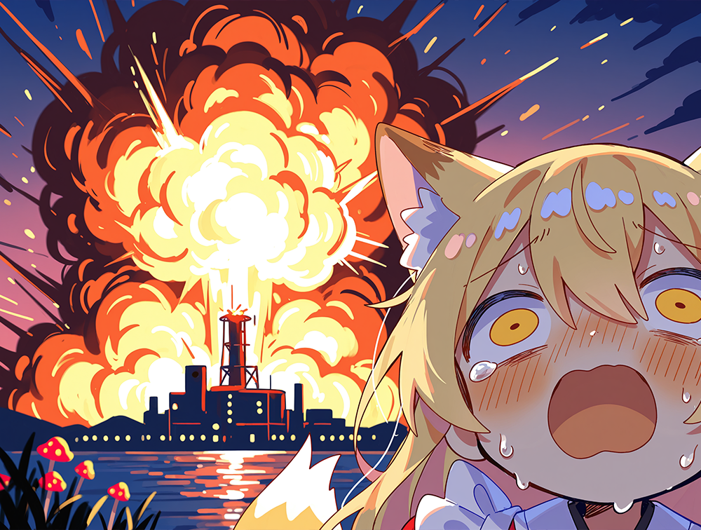</td><td></td></tr>
        <tr><td></td><td>Rare|能力</td><td></td></tr>
        <tr><td></td><td>每回合开始时获得 1 费，额外抽 1 张牌。每回合开始时将 1 张晕眩加入你的手牌，每回合增加 1。</td><td></td></tr>
      </table>
    </td>
    <td valign="top" style="width: 220px;">
      <table class="card-mini" style="width: 100%; table-layout: auto;">
        <tr><td>1</td><td>源质重构<br/>Essence Reconstruction</td><td></td></tr>
        <tr><td></td><td></td><td></td></tr>
        <tr><td></td><td>Rare|技能</td><td></td></tr>
        <tr><td></td><td>消耗所有手牌，获得等同于消耗数量的咏唱（升级后额外 +2），然后抽取等同于咏唱层数的牌。</td><td></td></tr>
      </table>
    </td>
    <td valign="top" style="width: 220px;">
      <table class="card-mini" style="width: 100%; table-layout: auto;">
        <tr><td>2</td><td>永恒旋律<br/>Eternal Melody</td><td></td></tr>
        <tr><td></td><td></td><td></td></tr>
        <tr><td></td><td>Rare|能力</td><td></td></tr>
        <tr><td></td><td>每当你打出魔法牌时，随机一名敌人失去 2 点生命上限。每拥有 2 点咏唱，额外失去 2 点生命上限。</td><td></td></tr>
      </table>
    </td>
  </tr>
  <tr>
    <td valign="top" style="width: 220px;">
      <table class="card-mini" style="width: 100%; table-layout: auto;">
        <tr><td>2</td><td>爆裂魔法<br/>Explosion Magic</td><td></td></tr>
        <tr><td></td><td></td><td></td></tr>
        <tr><td></td><td>Rare|技能</td><td></td></tr>
        <tr><td></td><td>给予所有敌人 12 层烧伤。失去 3 点敏捷。</td><td></td></tr>
      </table>
    </td>
    <td valign="top" style="width: 220px;">
      <table class="card-mini" style="width: 100%; table-layout: auto;">
        <tr><td>2</td><td>地狱馈赠<br/>Hell's Gift</td><td></td></tr>
        <tr><td></td><td></td><td></td></tr>
        <tr><td></td><td>Rare|技能</td><td></td></tr>
        <tr><td></td><td>**消耗**；将一张随机金质装备卡牌加入你的手牌。</td><td></td></tr>
      </table>
    </td>
    <td valign="top" style="width: 220px;">
      <table class="card-mini" style="width: 100%; table-layout: auto;">
        <tr><td>2</td><td>解放<br/>Liberation</td><td></td></tr>
        <tr><td></td><td></td><td></td></tr>
        <tr><td></td><td>Rare|能力</td><td></td></tr>
        <tr><td></td><td>回合结束时，触发你手牌中每张被保留的牌。</td><td></td></tr>
      </table>
    </td>
  </tr>
  <tr>
    <td valign="top" style="width: 220px;">
      <table class="card-mini" style="width: 100%; table-layout: auto;">
        <tr><td>1</td><td>魔力超负荷<br/>Magic Overloaded</td><td></td></tr>
        <tr><td></td><td>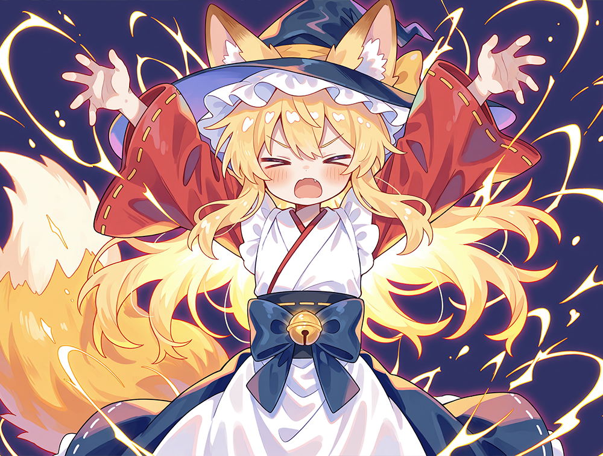</td><td></td></tr>
        <tr><td></td><td>Rare|能力</td><td></td></tr>
        <tr><td></td><td>你的魔法牌额外受到咏唱效果的 50%。升级后为 75%。</td><td></td></tr>
      </table>
    </td>
    <td valign="top" style="width: 220px;">
      <table class="card-mini" style="width: 100%; table-layout: auto;">
        <tr><td>2</td><td>女仆的援护<br/>Maid's Support</td><td></td></tr>
        <tr><td></td><td></td><td></td></tr>
        <tr><td></td><td>Rare|能力</td><td></td></tr>
        <tr><td></td><td>**仅多人**；为所有玩家添加 5 层覆甲，2 点荆棘。</td><td></td></tr>
      </table>
    </td>
    <td valign="top" style="width: 220px;">
      <table class="card-mini" style="width: 100%; table-layout: auto;">
        <tr><td>1</td><td>牛奶<br/>Milk</td><td></td></tr>
        <tr><td></td><td>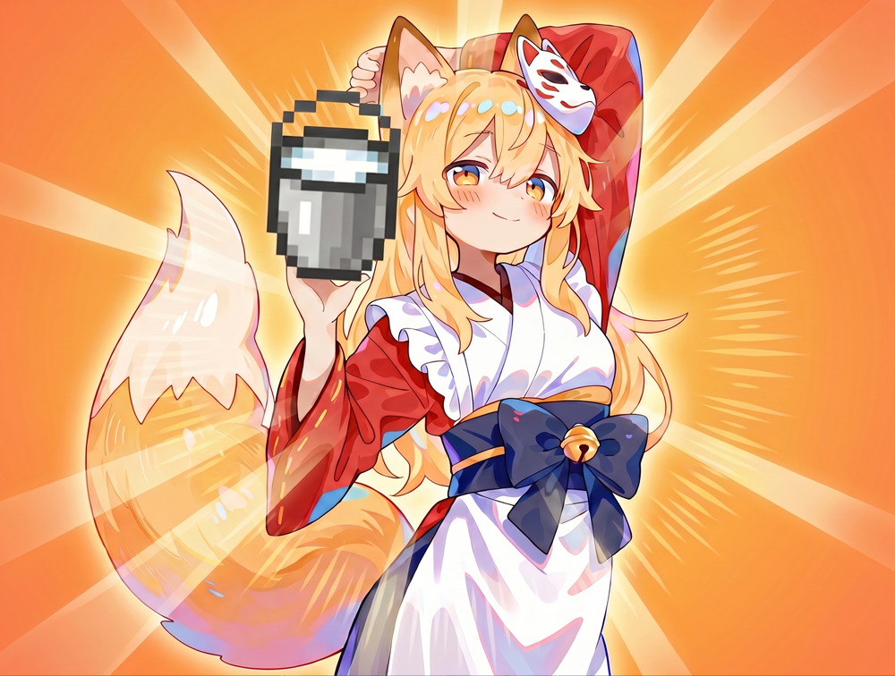</td><td></td></tr>
        <tr><td></td><td>Rare|技能</td><td></td></tr>
        <tr><td></td><td>**消耗**；消除你身上的所有负面效果。</td><td></td></tr>
      </table>
    </td>
  </tr>
  <tr>
    <td valign="top" style="width: 220px;">
      <table class="card-mini" style="width: 100%; table-layout: auto;">
        <tr><td>2</td><td>挖掘宝石<br/>Mining Gems</td><td></td></tr>
        <tr><td></td><td></td><td></td></tr>
        <tr><td></td><td>Rare|技能</td><td></td></tr>
        <tr><td></td><td>获得 2 个钻石。</td><td></td></tr>
      </table>
    </td>
    <td valign="top" style="width: 220px;">
      <table class="card-mini" style="width: 100%; table-layout: auto;">
        <tr><td>3</td><td>下界合金甲<br/>Netherite Chestplate</td><td></td></tr>
        <tr><td></td><td></td><td></td></tr>
        <tr><td></td><td>Rare|能力</td><td></td></tr>
        <tr><td></td><td>获得覆甲。翻倍你从覆甲获得的格挡。</td><td></td></tr>
      </table>
    </td>
    <td valign="top" style="width: 220px;">
      <table class="card-mini" style="width: 100%; table-layout: auto;">
        <tr><td>2</td><td>下界合金剑<br/>Netherite Sword</td><td></td></tr>
        <tr><td></td><td></td><td></td></tr>
        <tr><td></td><td>Rare|技能</td><td></td></tr>
        <tr><td></td><td>将你消耗牌堆中的所有剑打出。升级后会先将这些剑升级再打出。</td><td></td></tr>
      </table>
    </td>
  </tr>
  <tr>
    <td valign="top" style="width: 220px;">
      <table class="card-mini" style="width: 100%; table-layout: auto;">
        <tr><td>3</td><td>清算时间<br/>Payback Time</td><td></td></tr>
        <tr><td></td><td></td><td></td></tr>
        <tr><td></td><td>Rare|攻击</td><td></td></tr>
        <tr><td></td><td>造成基础伤害。在本场对战中你每获得一份材料，额外造成伤害。</td><td></td></tr>
      </table>
    </td>
    <td valign="top" style="width: 220px;">
      <table class="card-mini" style="width: 100%; table-layout: auto;">
        <tr><td>2</td><td>规划专家<br/>Planning Expert</td><td></td></tr>
        <tr><td></td><td></td><td></td></tr>
        <tr><td></td><td>Rare|能力</td><td></td></tr>
        <tr><td></td><td>每当你打出一张技能牌时，该牌获得保留。</td><td></td></tr>
      </table>
    </td>
    <td valign="top" style="width: 220px;">
      <table class="card-mini" style="width: 100%; table-layout: auto;">
        <tr><td>1</td><td>盾击<br/>Shield Bash</td><td></td></tr>
        <tr><td></td><td>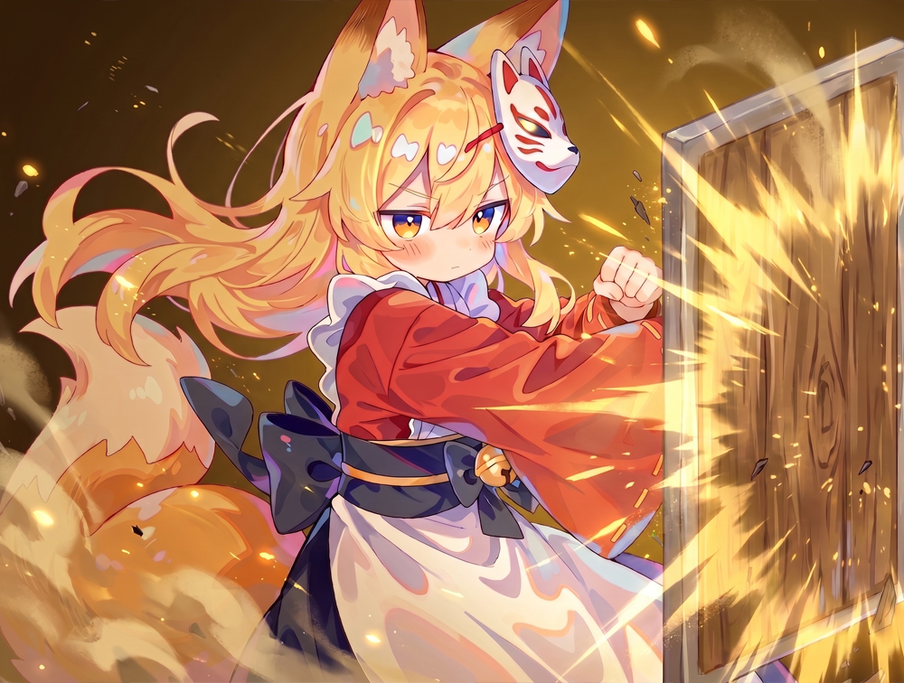</td><td></td></tr>
        <tr><td></td><td>Rare|攻击</td><td></td></tr>
        <tr><td></td><td>对所有敌人造成倍于你当前格挡的伤害。清除你的所有格挡。抽 1 张牌。</td><td></td></tr>
      </table>
    </td>
  </tr>
  <tr>
    <td valign="top" style="width: 220px;">
      <table class="card-mini" style="width: 100%; table-layout: auto;">
        <tr><td>4</td><td>飞转的手<br/>Spinning Hand</td><td></td></tr>
        <tr><td></td><td></td><td></td></tr>
        <tr><td></td><td>Rare|攻击</td><td></td></tr>
        <tr><td></td><td>你在战斗中临时加入的牌获得保留。回合结束时每保留 1 张牌，你就獲得格擋。</td><td></td></tr>
      </table>
    </td>
    <td valign="top" style="width: 220px;">
      <table class="card-mini" style="width: 100%; table-layout: auto;">
        <tr><td>3</td><td>灵狐形态<br/>Spirit Fox Form</td><td></td></tr>
        <tr><td></td><td></td><td></td></tr>
        <tr><td></td><td>Rare|能力</td><td></td></tr>
        <tr><td></td><td>**虚无**；每当你打出一张攻击牌时，对目标施加 1 层缓慢。</td><td></td></tr>
      </table>
    </td>
    <td valign="top" style="width: 220px;">
      <table class="card-mini" style="width: 100%; table-layout: auto;">
        <tr><td>2</td><td>蒸汽引擎<br/>Steam Engine</td><td></td></tr>
        <tr><td></td><td></td><td></td></tr>
        <tr><td></td><td>Rare|能力</td><td></td></tr>
        <tr><td></td><td>每回合开始时获得 1 应力。</td><td></td></tr>
      </table>
    </td>
  </tr>
  <tr>
    <td valign="top" style="width: 220px;">
      <table class="card-mini" style="width: 100%; table-layout: auto;">
        <tr><td>1</td><td>时代变了<br/>Times Have Changed</td><td></td></tr>
        <tr><td></td><td></td><td></td></tr>
        <tr><td></td><td>Rare|攻击</td><td></td></tr>
        <tr><td></td><td>造成伤害数次。花费 1 个铁锭，使这张牌在本场战斗中额外造成一次伤害。将这张牌返回你的手牌。</td><td></td></tr>
      </table>
    </td>
    <td valign="top" style="width: 220px;">
      <table class="card-mini" style="width: 100%; table-layout: auto;">
        <tr><td>1</td><td>无线合成终端<br/>Wireless Terminal</td><td></td></tr>
        <tr><td></td><td></td><td></td></tr>
        <tr><td></td><td>Rare|技能</td><td></td></tr>
        <tr><td></td><td>合成。将这张牌返回你的手牌。</td><td></td></tr>
      </table>
    </td>
    <td></td>
  </tr>
</table>

### Ancient（先古之民）

<table>
  <tr>
    <td valign="top" style="width: 220px;">
      <table class="card-mini" style="width: 100%; table-layout: auto;">
        <tr><td>1</td><td>锻造<br/>Forging</td><td></td></tr>
        <tr><td></td><td></td><td></td></tr>
        <tr><td></td><td>Ancient|技能</td><td></td></tr>
        <tr><td></td><td>**保留**；获得格挡。合成两次。</td><td></td></tr>
      </table>
    </td>
    <td valign="top" style="width: 220px;">
      <table class="card-mini" style="width: 100%; table-layout: auto;">
        <tr><td>1</td><td>下界合金镐<br/>Netherite Pickaxe</td><td></td></tr>
        <tr><td></td><td></td><td></td></tr>
        <tr><td></td><td>Ancient|能力</td><td></td></tr>
        <tr><td></td><td>在同一个回合内每打出 2 张牌，就获得木板、圆石、铁锭和钻石各 1 个。</td><td></td></tr>
      </table>
    </td>
    <td></td>
  </tr>
</table>

### Token（战斗生成）

<table>
  <tr>
    <td valign="top" style="width: 220px;">
      <table class="card-mini" style="width: 100%; table-layout: auto;">
        <tr><td>0</td><td>空手打击<br/>Bare-Handed Strike</td><td></td></tr>
        <tr><td></td><td>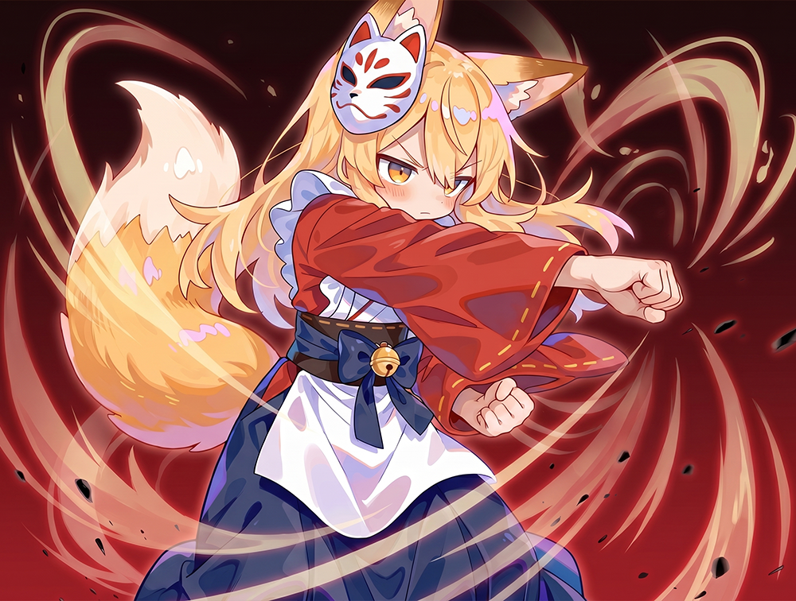</td><td></td></tr>
        <tr><td></td><td>Token|攻击</td><td></td></tr>
        <tr><td></td><td>**消耗**；造成 1 点伤害。</td><td></td></tr>
      </table>
    </td>
    <td valign="top" style="width: 220px;">
      <table class="card-mini" style="width: 100%; table-layout: auto;">
        <tr><td>0</td><td>钻石甲<br/>Diamond Armor</td><td></td></tr>
        <tr><td></td><td></td><td></td></tr>
        <tr><td></td><td>Token|能力</td><td></td></tr>
        <tr><td></td><td>**消耗**；获得覆甲。如果回合结束时你还有覆甲，就在本回合保留你的格挡。</td><td></td></tr>
      </table>
    </td>
    <td valign="top" style="width: 220px;">
      <table class="card-mini" style="width: 100%; table-layout: auto;">
        <tr><td>0</td><td>钻石镐<br/>Diamond Pickaxe</td><td></td></tr>
        <tr><td></td><td></td><td></td></tr>
        <tr><td></td><td>Token|能力</td><td></td></tr>
        <tr><td></td><td>**消耗**；当你合成一张牌时，将其升级。升级后：合成。</td><td></td></tr>
      </table>
    </td>
  </tr>
  <tr>
    <td valign="top" style="width: 220px;">
      <table class="card-mini" style="width: 100%; table-layout: auto;">
        <tr><td>0</td><td>钻石剑<br/>Diamond Sword</td><td></td></tr>
        <tr><td></td><td></td><td></td></tr>
        <tr><td></td><td>Token|攻击</td><td></td></tr>
        <tr><td></td><td>**消耗**；造成 20 点伤害；每回合前 1 张攻击牌额外打出一次。</td><td></td></tr>
      </table>
    </td>
    <td valign="top" style="width: 220px;">
      <table class="card-mini" style="width: 100%; table-layout: auto;">
        <tr><td>0</td><td>金甲<br/>Golden Armor</td><td></td></tr>
        <tr><td></td><td></td><td></td></tr>
        <tr><td></td><td>Token|能力</td><td></td></tr>
        <tr><td></td><td>**消耗**；获得缓冲，1 层人工制品。当你失去缓冲时，回复等同于你应受到伤害的生命值。</td><td></td></tr>
      </table>
    </td>
    <td valign="top" style="width: 220px;">
      <table class="card-mini" style="width: 100%; table-layout: auto;">
        <tr><td>0</td><td>金镐<br/>Golden Pickaxe</td><td></td></tr>
        <tr><td></td><td></td><td></td></tr>
        <tr><td></td><td>Token|能力</td><td></td></tr>
        <tr><td></td><td>每次你获得材料，就获得等量格挡并对随机敌人造成 2 倍等量伤害。升级后：3 倍。</td><td></td></tr>
      </table>
    </td>
  </tr>
  <tr>
    <td valign="top" style="width: 220px;">
      <table class="card-mini" style="width: 100%; table-layout: auto;">
        <tr><td>0</td><td>金剑<br/>Golden Sword</td><td></td></tr>
        <tr><td></td><td></td><td></td></tr>
        <tr><td></td><td>Token|能力</td><td></td></tr>
        <tr><td></td><td>你每打出两张攻击牌就获得 1 费，所有攻击牌获得虚无。升级后：移除虚无效果。</td><td></td></tr>
      </table>
    </td>
    <td valign="top" style="width: 220px;">
      <table class="card-mini" style="width: 100%; table-layout: auto;">
        <tr><td>0</td><td>铁甲<br/>Iron Armor</td><td></td></tr>
        <tr><td></td><td></td><td></td></tr>
        <tr><td></td><td>Token|能力</td><td></td></tr>
        <tr><td></td><td>**消耗**；获得覆甲。你的覆甲层数不会降低。</td><td></td></tr>
      </table>
    </td>
    <td valign="top" style="width: 220px;">
      <table class="card-mini" style="width: 100%; table-layout: auto;">
        <tr><td>0</td><td>铁镐<br/>Iron Pickaxe</td><td></td></tr>
        <tr><td></td><td></td><td></td></tr>
        <tr><td></td><td>Token|技能</td><td></td></tr>
        <tr><td></td><td>**消耗**；接下来数次获得资源时，额外获得 3 个铁锭。</td><td></td></tr>
      </table>
    </td>
  </tr>
  <tr>
    <td valign="top" style="width: 220px;">
      <table class="card-mini" style="width: 100%; table-layout: auto;">
        <tr><td>0</td><td>铁剑<br/>Iron Sword</td><td></td></tr>
        <tr><td></td><td></td><td></td></tr>
        <tr><td></td><td>Token|攻击</td><td></td></tr>
        <tr><td></td><td>**消耗**；造成 14 点伤害；下 1 张攻击牌额外打出一次。</td><td></td></tr>
      </table>
    </td>
    <td valign="top" style="width: 220px;">
      <table class="card-mini" style="width: 100%; table-layout: auto;">
        <tr><td>0</td><td>获得材料<br/>Obtain Materials</td><td></td></tr>
        <tr><td></td><td>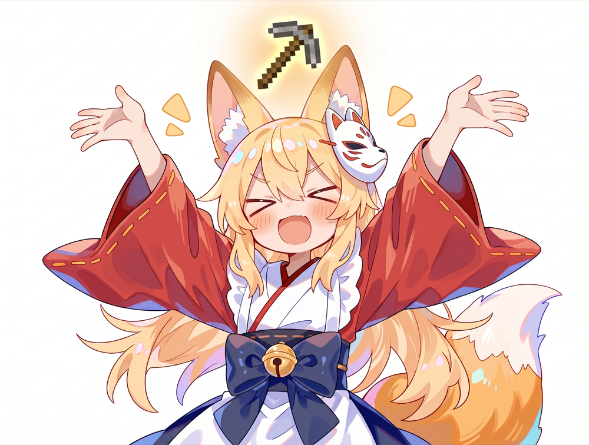</td><td></td></tr>
        <tr><td></td><td>Token|技能</td><td></td></tr>
        <tr><td></td><td>获得 1 个木板和 3 个圆石。升级后木板改为 3，并额外获得 3 个铁锭。</td><td></td></tr>
      </table>
    </td>
    <td valign="top" style="width: 220px;">
      <table class="card-mini" style="width: 100%; table-layout: auto;">
        <tr><td>0</td><td>获得应力<br/>Obtain Stress</td><td></td></tr>
        <tr><td></td><td></td><td></td></tr>
        <tr><td></td><td>Token|技能</td><td></td></tr>
        <tr><td></td><td>获得 3 层应力，结束回合。</td><td></td></tr>
      </table>
    </td>
  </tr>
  <tr>
    <td valign="top" style="width: 220px;">
      <table class="card-mini" style="width: 100%; table-layout: auto;">
        <tr><td>?</td><td>精巧背包:合成升级<br/>Refined Backpack: Crafting Upgrade</td><td></td></tr>
        <tr><td></td><td></td><td></td></tr>
        <tr><td></td><td>Token|Unknown</td><td></td></tr>
        <tr><td></td><td>给精妙背包提供额外效果：每合成 2 次，额外进行 1 次合成。只能合成一次。</td><td></td></tr>
      </table>
    </td>
    <td valign="top" style="width: 220px;">
      <table class="card-mini" style="width: 100%; table-layout: auto;">
        <tr><td>?</td><td>精巧背包:喂食升级<br/>Refined Backpack: Feeding Upgrade</td><td></td></tr>
        <tr><td></td><td></td><td></td></tr>
        <tr><td></td><td>Token|Unknown</td><td></td></tr>
        <tr><td></td><td>给精妙背包提供额外效果：每回合开始时，获得 1 再生。只能合成一次。</td><td></td></tr>
      </table>
    </td>
    <td valign="top" style="width: 220px;">
      <table class="card-mini" style="width: 100%; table-layout: auto;">
        <tr><td>?</td><td>精巧背包:补货升级<br/>Refined Backpack: Restock Upgrade</td><td></td></tr>
        <tr><td></td><td></td><td></td></tr>
        <tr><td></td><td>Token|Unknown</td><td></td></tr>
        <tr><td></td><td>给精妙背包提供额外效果：每场战斗开始时，额外抽两张牌。只能合成一次。</td><td></td></tr>
      </table>
    </td>
  </tr>
  <tr>
    <td valign="top" style="width: 220px;">
      <table class="card-mini" style="width: 100%; table-layout: auto;">
        <tr><td>?</td><td>精巧背包:储蓄升级<br/>Refined Backpack: Savings Upgrade</td><td></td></tr>
        <tr><td></td><td></td><td></td></tr>
        <tr><td></td><td>Token|Unknown</td><td></td></tr>
        <tr><td></td><td>给精妙背包提供额外效果：战斗结束时，额外获得 15 金币。只能合成一次。</td><td></td></tr>
      </table>
    </td>
    <td valign="top" style="width: 220px;">
      <table class="card-mini" style="width: 100%; table-layout: auto;">
        <tr><td>?</td><td>精巧背包:熔炼升级<br/>Refined Backpack: Smelting Upgrade</td><td></td></tr>
        <tr><td></td><td></td><td></td></tr>
        <tr><td></td><td>Token|Unknown</td><td></td></tr>
        <tr><td></td><td>给精妙背包提供额外效果：每回合开始时，获得 1 个铁锭。只能合成一次。</td><td></td></tr>
      </table>
    </td>
    <td valign="top" style="width: 220px;">
      <table class="card-mini" style="width: 100%; table-layout: auto;">
        <tr><td>?</td><td>精巧背包:切石机升级<br/>Refined Backpack: Stonecutter Upgrade</td><td></td></tr>
        <tr><td></td><td></td><td></td></tr>
        <tr><td></td><td>Token|Unknown</td><td></td></tr>
        <tr><td></td><td>给精妙背包提供额外效果：每三个回合将你的圆石翻倍。只能合成一次。</td><td></td></tr>
      </table>
    </td>
  </tr>
  <tr>
    <td valign="top" style="width: 220px;">
      <table class="card-mini" style="width: 100%; table-layout: auto;">
        <tr><td>0</td><td>盾牌<br/>Shield</td><td></td></tr>
        <tr><td></td><td></td><td></td></tr>
        <tr><td></td><td>Token|技能</td><td></td></tr>
        <tr><td></td><td>**消耗**；选择一名角色在本回合获得敏捷。此牌在本回合与下一回合不能再次打出。升级后：仅本回合不能再次打出。</td><td></td></tr>
      </table>
    </td>
    <td valign="top" style="width: 220px;">
      <table class="card-mini" style="width: 100%; table-layout: auto;">
        <tr><td>0</td><td>砖石甲<br/>Stone Brick Armor</td><td></td></tr>
        <tr><td></td><td></td><td></td></tr>
        <tr><td></td><td>Token|能力</td><td></td></tr>
        <tr><td></td><td>**消耗**；获得覆甲，每回合开始时失去 1 点敏捷。</td><td></td></tr>
      </table>
    </td>
    <td valign="top" style="width: 220px;">
      <table class="card-mini" style="width: 100%; table-layout: auto;">
        <tr><td>0</td><td>石镐<br/>Stone Pickaxe</td><td></td></tr>
        <tr><td></td><td></td><td></td></tr>
        <tr><td></td><td>Token|能力</td><td></td></tr>
        <tr><td></td><td>**消耗**；每回合开始时，获得 1 个木板和 1 个圆石。</td><td></td></tr>
      </table>
    </td>
  </tr>
  <tr>
    <td valign="top" style="width: 220px;">
      <table class="card-mini" style="width: 100%; table-layout: auto;">
        <tr><td>0</td><td>石剑<br/>Stone Sword</td><td></td></tr>
        <tr><td></td><td></td><td></td></tr>
        <tr><td></td><td>Token|攻击</td><td></td></tr>
        <tr><td></td><td>**消耗**；造成 9 点伤害；获得 2 层力量。</td><td></td></tr>
      </table>
    </td>
    <td valign="top" style="width: 220px;">
      <table class="card-mini" style="width: 100%; table-layout: auto;">
        <tr><td>0</td><td>木甲<br/>Wooden Armor</td><td></td></tr>
        <tr><td></td><td></td><td></td></tr>
        <tr><td></td><td>Token|技能</td><td></td></tr>
        <tr><td></td><td>**消耗**；获得格挡。</td><td></td></tr>
      </table>
    </td>
    <td valign="top" style="width: 220px;">
      <table class="card-mini" style="width: 100%; table-layout: auto;">
        <tr><td>0</td><td>木镐<br/>Wooden Pickaxe</td><td></td></tr>
        <tr><td></td><td></td><td></td></tr>
        <tr><td></td><td>Token|技能</td><td></td></tr>
        <tr><td></td><td>**消耗**；下个回合开始时，获得 2 费，抽 1 张牌。</td><td></td></tr>
      </table>
    </td>
  </tr>
  <tr>
    <td valign="top" style="width: 220px;">
      <table class="card-mini" style="width: 100%; table-layout: auto;">
        <tr><td>0</td><td>木剑<br/>Wooden Sword</td><td></td></tr>
        <tr><td></td><td></td><td></td></tr>
        <tr><td></td><td>Token|攻击</td><td></td></tr>
        <tr><td></td><td>**消耗**；造成 6 点伤害；获得 4 层活力。</td><td></td></tr>
      </table>
    </td>
    <td valign="top" style="width: 220px;">
      <table class="card-mini" style="width: 100%; table-layout: auto;">
        <tr><td>0</td><td>加班加点<br/>Work Overtime</td><td></td></tr>
        <tr><td></td><td>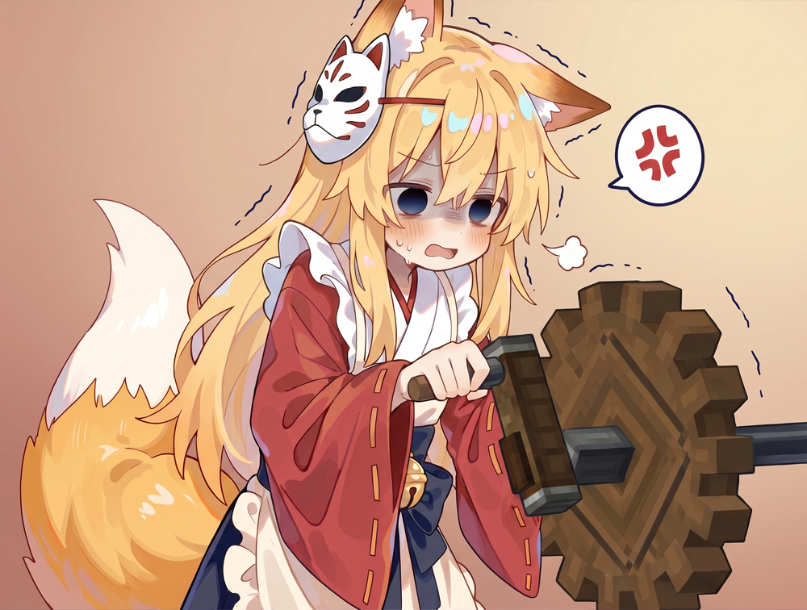</td><td></td></tr>
        <tr><td></td><td>Token|技能</td><td></td></tr>
        <tr><td></td><td>**消耗**；获得 1 应力。升级后：额外抽 1 张牌。</td><td></td></tr>
      </table>
    </td>
    <td></td>
  </tr>
</table>
---

## Power 列表

### 材料 Power（MaterialPower）

| Power | 类型 | 效果 |
|-------|------|------|
| WoodPower（木板） | Buff Counter | 一块处理过的木板，可用于合成。 |
| StonePower（圆石） | Buff Counter | 坚硬的圆石，可用于合成。 |
| IronPower（铁锭） | Buff Counter | 坚固的铁锭，可用于合成。 |
| DiamondPower（钻石） | Buff Counter | 珍贵的钻石，可用于合成。 |

### 应力相关

| Power | 类型 | 效果 |
|-------|------|------|
| StressPower（应力） | Buff Counter | 从卡牌获得材料时，同一次结算只花费 1 层，使该次获得的材料数量翻倍（能力、遗物等途径不计入）。 |

### 回合开始触发

| Power                    | 类型 | 效果 |
|--------------------------|------|------|
| DiggingPower（工具：石镐）      | Buff Counter | 每回合开始时，获得 N 个木板和 N 个圆石。 |
| PlantPower（种植）           | Buff Counter | 下回合开始时，获得 N 木板，触发后消除。 |
| SteamPower（蒸汽）           | Buff Counter | 每回合开始时，获得 N 应力。 |
| AutoCrafterPower（自动合成器）  | Buff Counter | 当你的回合开始时，合成 N 次。 |
| BrushStoneFormPower（刷石机） | Buff Counter | 在你的回合开始时获得 N 圆石，每回合层数增加（N 递增）。 |
| RepairPower（修复）          | Buff Counter | 下回合开始时，获得 N 层应力，消除。 |
| EasyPeasyPower（核电，轻而易举啊） | Buff Counter | 回合开始时，获得 N 费用，抽 N 张卡。 |
| RadiationLeakPower（坏了坏了） | Debuff Counter | 回合开始时，将 N 张晕眩加入你的手牌，每回合增加 1 层。 |

### 装备效果 Power

| Power | 类型 | 效果                                  |
|-------|------|-------------------------------------|
| WoodenSwordPower（武器:木剑） | Buff Counter | 每回合开始时获得 4 层活力。还剩 N 回合。             |
| StoneSwordPower（武器:石剑） | Debuff Counter | 每回合开始时，失去 2 点力量。还剩 N 回合。            |
| IronSwordPower（武器：铁剑） | Buff Counter | 接下来 N 张攻击牌额外打出一次。                   |
| DiamondSwordPower（武器：钻石剑） | Buff Counter | 每回合前 N 张攻击牌额外打出一次。                  |
| GoldenSwordPower（武器：金剑） | Buff Counter | 你每打出两张攻击牌就获得 1 费，所有攻击牌获得虚无。         |
| IronArmorPower（装备：铁甲） | Buff None | 你的覆甲层数不会降低。 |
| StoneArmorPower（装备：砖石甲） | Debuff Counter | 每回合开始时，失去 N 点敏捷。 |
| DiamondArmorPower（装备：钻石甲） | Buff None | 如果回合结束时你还有覆甲，就在本回合保留你的格挡。 |
| GoldenArmorPower（装备：金甲） | Buff None | 当你失去缓冲时，回复等同于你应受到伤害的生命值。 |
| NetheriteChestPlatePower（装备：下界合金甲） | Buff None | 翻倍你从覆甲获得的格挡。 |
| IronPickaxePower（工具：铁镐） | Buff Counter | 从牌中获得资源时，额外获得 2 个铁锭。还剩 N 次。 |
| GoldenPickaxePower（工具：金镐） | Buff Counter | 每次你获得材料，就获得等量格挡并对随机敌人造成 N 倍等量伤害。    |
| NetheritePickaxePower（工具：下界合金镐） | Buff Counter | 每在同一个回合内打出 2 张牌，就获得木板、石头、铁、钻石各 1 个。 |
| ShieldDexPower（盾牌敏捷） | Buff | 临时敏捷（来自盾牌）。                         |
| ShieldCooldownPower（盾牌冷却） | Debuff Counter | 无法打出盾牌。还剩 N 回合。                     |

### 其他特殊 Power

| Power | 类型 | 效果 |
|-------|------|------|
| LaunchPlatformPower（弹射置物台） | Buff None | 每回合第一次消耗应力时，获得 1 点能量。 |
| LiberationPower（解放） | Buff None | 回合结束时，触发你手牌中每张被保留的牌。 |
| MemoryPower（回忆） | Buff Counter | 在你的回合开始时，将上一回合最后打出的技能牌的一张带有消耗的复制品加入你的手牌。升级（MemoryPower+）：复制品附加保留。 |
| OtherworldCrossingPower（异界跨越） | Buff Counter | 每回合开始时，选择一张手牌，将其一张虚无、消耗的复制品加入到你的手牌。 |
| PlanningExpertPower（规划专家） | Buff None | 每当你打出一张技能牌时，该牌获得保留。 |
| SpiritFoxFormPower（灵狐形态） | Buff None | 每当你打出一张攻击牌时，对目标施加 1 层缓慢。 |
| TrackingPower（间隙咏唱） | Buff Counter | 每当你使敌人失去生命时，该敌人获得 1 点格挡，你获得 N 点格挡。 |
| HighlyFocusedPower（高度专注） | Buff Counter | 在本回合翻倍你已有的力量。 |
| AnticipateAdvantageDexPower（预判先机） | Buff Counter | 本回合获得 N 点敏捷，回合结束时消失。 |
| MassProductionPower（量产） | Buff Counter | 本回合中的合成产物将复制给其他玩家 N 张。回合结束消除。 |
| ProductionDocumentPower（生产记录） | Buff Counter | 你在战斗中临时加入的牌获得保留。回合结束时每保留 1 张牌，你就获得 N 点格挡。 |
| SnowBallOverwhelmingPower（雪球糊脸） | Buff Counter | 本回合打出的下一张技能牌费用变为 0。每出 1 张技能消耗 1 层；回合结束消除。 |
| SlashBladeWoodPower（拔刀剑:无铭刀「木偶」） | Buff Counter | 每当你打出一张技能牌，获得 N 层活力。 |
| BurningPower（烧伤） | Debuff Counter | 烧伤的生物会在自身回合开始时失去生命。烧伤层数每回合减半（向上取整）。 |

---

## 遗物列表

| 遗物 | 稀有度 | 效果 |
|------|--------|------|
| HandCrank（手摇曲柄） | Starter | 在每场战斗开始时，选择获得应力，或获得木板和圆石。 |
| Deployer（神之手） | Starter | 在每场战斗开始时，选择获得应力，或获得木板、圆石和铁锭。 |
| MaidBackpack（女仆背包） | Uncommon | 拾取时获得 2 个药水槽位并将所有空槽位填满随机药水。 |
| SophisticatedBackpack（精妙背包） | Rare | 提供额外的合成卡牌：背包升级。可通过升级卡解锁喂食（每回合回血）、熔炼（每回合获得铁锭）、合成触发、切石机（定期圆石翻倍）、储蓄（战斗结束获金币）、补货（战斗开始抽牌）等效果。 |
| TotemofUndying（不死图腾） | Rare | 当你要被杀死时，免死并回复最大生命值的 35%，获得 10 层再生和 15 点格挡。（仅一次） |

---

## 合成配方

| 产物 | 所需材料 |
|------|---------|
| 空手打击 | 无 |
| 木镐 | 4 木板 |
| 木剑 | 3 木板 |
| 木甲 | 4 木板 |
| 石镐 | 1 木板 + 3 圆石 |
| 石剑 | 1 木板 + 2 圆石 |
| 砖石甲 | 8 圆石 |
| 铁镐 | 1 木板 + 3 铁锭 |
| 铁剑 | 1 木板 + 2 铁锭 |
| 铁甲 | 8 铁锭 |
| 钻石镐 | 1 木板 + 3 钻石 |
| 钻石剑 | 1 木板 + 2 钻石 |
| 钻石甲 | 8 钻石 |
| 盾牌 | 6 木板 + 1 铁锭 |

---

## 项目结构

```
STS2_WineFox/
├── Cards/
│   ├── Basic/              # 基础卡（不进入奖励池）
│   ├── Common/             # 普通奖励卡
│   ├── Uncommon/           # 非普通奖励卡
│   ├── Rare/               # 稀有奖励卡
│   ├── Ancient/            # 古代奖励卡
│   ├── Token/              # 战斗中临时生成的卡（autoAdd: false）
│   │   ├── Craft/          # 合成配方产物（剑/镐/甲/盾等）
│   │   ├── HandCrank/      # 手摇曲柄遗物相关 Token
│   │   ├── HellGift/       # 地狱馈赠产物（金剑/金镐/金甲）
│   │   ├── LessHoliday/    # 996 产物（加班加点）
│   │   └── SophisticatedBackpack/ # 精密背包升级卡
│   ├── CraftRecipeRegistry.cs  # 合成配方注册表
│   ├── WineFoxCard.cs      # 卡牌基类
│   ├── WineFoxCardVarFactory.cs # 卡牌 DynamicVar 工厂（应力翻倍等）
│   └── WineFoxKeywords.cs  # 关键字 ID 常量
├── Character/
│   ├── WineFox.cs          # 角色定义（HP、初始牌组、初始遗物）
│   ├── WineFoxCardPool.cs  # 卡池（外框颜色、能量图标）
│   ├── WineFoxRelicPool.cs
│   └── WineFoxPotionPool.cs
├── Commands/
│   ├── CraftCmd.cs         # 合成命令（合成选择、材料消耗、记录）
│   ├── CraftDeliveryMode.cs
│   ├── CraftExecutionContext.cs
│   ├── MaterialCmd.cs      # 材料命令（获得/消耗材料）
│   ├── MaterialEventFlow.cs
│   ├── MaterialPowerRegistry.cs
│   └── StressCmd.cs
├── Content/
│   ├── WineFoxAutoRegistrationKeywords.cs  # 关键字自动注册（[RegisterOwnedCardKeyword]）
│   └── Descriptors/
│       └── WineFoxCharacterAssets.cs       # 角色资源注册
├── Enchantments/           # 附魔效果
├── Epoch/                  # 行动完成 Epoch 解锁
├── Events/                 # 事件
├── Hooks/                  # 框架钩子
├── Powers/
│   ├── WineFoxPower.cs         # Power 基类
│   ├── MaterialPower.cs        # 材料 Power 基类
│   ├── MaterialReactivePower.cs # 材料事件响应 Power 基类
│   └── ...（各 Power 类）
├── Relics/
│   ├── Backpack/               # SophisticatedBackpack 效果模块
│   ├── WineFoxRelic.cs         # 遗物基类
│   └── ...（各遗物类）
├── Screens/                # 自定义界面
├── STS2_WineFox/           # 游戏资源（Godot 导出目录）
│   ├── cards/              # 卡牌图片
│   ├── powers/             # Power 图标
│   ├── relics/             # 遗物图标
│   └── localization/
│       ├── zhs/            # 简体中文（cards / powers / relics / card_keywords）
│       └── eng/            # 英文
├── Utils/                  # 工具类
├── Const.cs                # 全局路径与常量
└── Main.cs                 # Mod 入口（程序集扫描自动注册）
```

---

## 开发指南

> 本项目使用 **STS2-RitsuLib** 的属性驱动自动注册机制。`Main.cs` 启动时会调用 `ModTypeDiscoveryHub.RegisterModAssembly` 扫描整个程序集，所有标注了 `[RegisterCard]`、`[RegisterRelic]`、`[RegisterOwnedCardKeyword]` 等特性的类型将自动完成注册，**无需**手动维护任何内容清单文件。

---

### 添加新卡牌

| 步骤 | 文件 | 操作 |
|------|------|------|
| 1 | `Cards/{Rarity}/XxxCard.cs` | 创建卡牌类，继承 `WineFoxCard`，并在类上添加 `[RegisterCard(typeof(WineFoxCardPool))]` 特性 |
| 2 | `Const.cs` | `Paths` 中添加 `CardXxx = Root + "/cards/card_xxx.png"` |
| 3 | `STS2_WineFox/cards/` | 放入卡牌图片 `card_xxx.png` |
| 4 | `localization/zhs/cards.json` | 添加 `title` 和 `description` |
| 5 | `localization/eng/cards.json` | 同上（英文） |
| 6 | `Character/WineFox.cs` | 若需加入初始牌组，在 `StartingDeckTypes` 中添加（**仅限 Basic 牌**） |

> **Token 卡**额外注意：改用 `[RegisterCard(typeof(WineFoxTokenCardPool))]` 特性，并在构造函数参数中加 `showInCardLibrary: false, autoAdd: false`，无需其他额外注册步骤。

#### 稀有度与奖励池

| 稀有度 | 可作为战斗奖励 | 用途 |
|--------|:------------:|------|
| `Basic` | ❌ | 初始牌组专用 |
| `Common` | ✅ | 普通战斗奖励 |
| `Uncommon` | ✅ | 精英/事件奖励 |
| `Rare` | ✅ | 稀有奖励 |
| `Ancient` | ✅ | 古代奖励 |
| `Token` | ❌ | 战斗中临时生成 |

> ⚠️ 奖励池中至少需要一张 Common 或更高稀有度的非黑名单卡，否则战斗结算时会崩溃。  
> ⚠️ 已在初始牌组（`StartingDeckTypes`）中的卡会被奖励系统永久列入黑名单，无法再次获得。

---

### 添加新 Power

| 步骤 | 文件 | 操作 |
|------|------|------|
| 1 | `Powers/XxxPower.cs` | 创建 Power 类，继承 `WineFoxPower`（或 `MaterialPower` / `MaterialReactivePower`） |
| 2 | `Const.cs` | `Paths` 中添加 `XxxPowerIcon = Root + "/powers/xxx.png"` |
| 3 | `STS2_WineFox/powers/` | 放入图标图片 |
| 4 | `localization/zhs/powers.json` | 添加 `title`、`description`、`smartDescription` |
| 5 | `localization/eng/powers.json` | 同上（英文） |

> Power 类通过框架约定（命名 / 图标路径属性）自动被发现，无需手动注册。

#### Power 本地化字段说明

| 字段 | 支持变量 | 显示时机 |
|------|:-------:|---------|
| `description` | ❌ 纯文本，用硬编码数字 | 卡牌库、非战斗状态 |
| `smartDescription` | ✅ `{Amount}` | 战斗中 Power 图标悬浮提示 |

#### PowerStackType 说明

| 值 | 含义 | 示例 |
|----|------|------|
| `None` | 不叠加，特殊逻辑用 | DiamondArmorPower |
| `Counter` | 可叠加计数 | 木板、力量、挖掘 |
| `Single` | 仅有/无，不计层数 | 脆弱、缴械 |

---

### 添加新关键字（可选）

| 步骤 | 文件 | 操作 |
|------|------|------|
| 1 | `Cards/WineFoxKeywords.cs` | 添加 `public const string XxxKey = "STS2_WINEFOX-XXX"` |
| 2 | `Content/WineFoxAutoRegistrationKeywords.cs` | 在类内部新增一个带 `[RegisterOwnedCardKeyword(WineFoxKeywords.XxxKey, LocKeyPrefix = "STS2_WINEFOX-XXX")]` 特性的私有 `sealed class` |
| 3 | `localization/zhs/card_keywords.json` | 添加 `title` 和 `description` |
| 4 | `localization/eng/card_keywords.json` | 同上（英文） |

> ⚠️ 关键字描述是**纯静态文本**，不支持 `{VarName:diff()}` 等动态变量。  
> 若关键字需要显示图标，在 `[RegisterOwnedCardKeyword]` 中补充 `IconPath = Const.Paths.XxxIcon`。

---

### 本地化说明

#### 卡牌描述动态变量

| 格式 | 效果 |
|------|------|
| `{VarName}` | 显示变量当前值（静态） |
| `{VarName:diff()}` | 显示当前值，升级或受加成时高亮显示差异（推荐） |

| 位置 | 支持动态变量 |
|------|:-----------:|
| `cards.json` 卡牌描述（绑定 `CanonicalVars`） | ✅ |
| `card_keywords.json` 关键字悬浮描述 | ❌ |
| `powers.json` → `description` | ❌ |
| `powers.json` → `smartDescription` | ✅（仅 `{Amount}`） |

#### 常用 DynamicVar 类型

| 类 | 描述变量 | 用途 |
|----|---------|------|
| `DamageVar(value, ValueProp.Move)` | `{Damage:diff()}` | 攻击伤害 |
| `BlockVar(value, ValueProp.Move)` | `{Block:diff()}` | 格挡 |
| `PowerVar<T>("Name", value)` | `{Name:diff()}` | Power 层数 |
| `new("Name", value)` | `{Name:diff()}` | 自定义数值 |
| `CardsVar(value)` | `{Cards:diff()}` | 摸牌数 |
| `EnergyVar(value)` | `{Energy:diff()}` | 费用/能量 |

---

